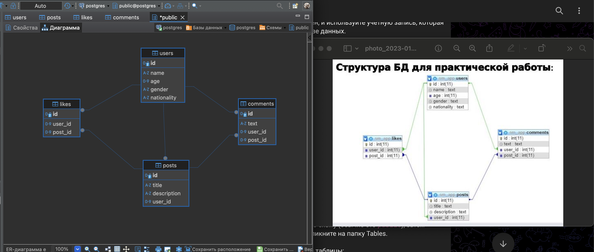

Реализовать в базе данных SQLite, Postgres, MySQL или MariaDB таблички, которые на картинке. И также необходимо связать их внешними ключами.

Id в каждой таблице — первичный ключ, autoincrement.

user_id, post_id — внешние ключи.

Заполнить все таблицы, создав минимум по 5 записей: 5 пользователей, у каждого пользователя хотя бы по одному посту. А лучше — по несколько. У каждого пользователя есть лайки других постов, а так же комментарии.

Загрузить на гитхаб dump базы данных (.sql), сделать скрин похожей диаграммы в ваших программах с вашей БД и тоже загрузить в гитхаб эту картинку. Добавить ее в readme.md в папке с уроком №12.

Важное замечание:

Во вторичном ключе должны быть существующие id из первичного ключа соответствующей таблицы. Например, если есть только один пользователь с id=1, то во вторичном ключе не может быть user_id=2 — только user_id=1. Если есть 2 пользователя, то возможны 2 варианта в user_id, и так далее.